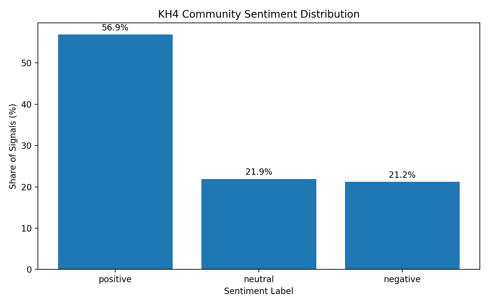
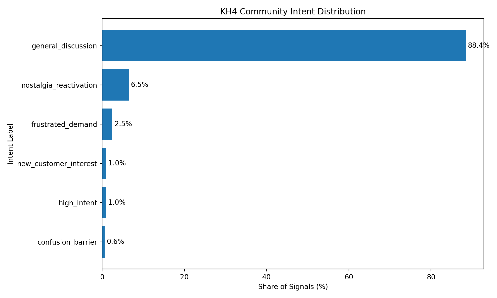
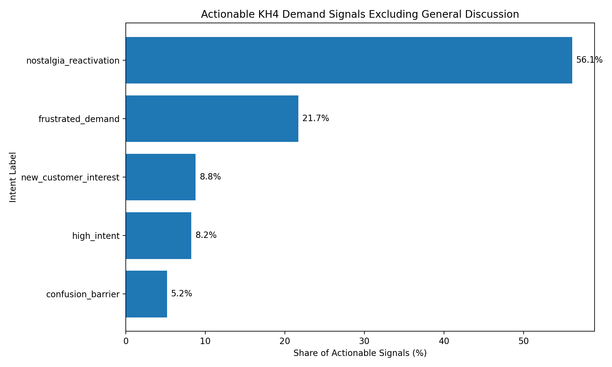

# Kingdom Hearts IV: Demand Intelligence

An evaluated Python NLP pipeline that transforms Reddit and YouTube community discussion around Kingdom Hearts IV into structured sentiment, intent, and demand signals.

The project is framed as **community demand intelligence**: a reproducible, test-backed workflow for turning noisy fan discourse into behavioural signals that can support product and marketing decisions. It uses an **evaluated rule-based NLP baseline**, includes **audit-backed taxonomy refinement**, and applies **recommendation-system-adjacent thinking** around implicit feedback and user intent.
---

## Project status

**Implemented**
- Reddit + YouTube ingestion
- Preprocessing pipeline
- VADER sentiment analysis
- Rule-based intent classification
- Demand scoring layer
- Manually audited evaluation corpus
- `pytest` regression testing

**Planned**
- Streamlit dashboard
- FastAPI layer
- Transformer-based NLP models
- Temporal analysis

**This project is currently an evaluated analytical prototype, not a deployed production system.**

---

## Pipeline

```
Ingest → Clean → Sentiment → Intent → Score → Audit
```

- **Ingest**: Reddit (PullPush) and YouTube community comments
- **Clean**: Text normalization and schema alignment
- **Sentiment**: VADER polarity scoring
- **Intent**: Rule-based behavioural intent classification
- **Score**: Heuristic demand/intensity scoring for decision support
- **Audit**: Manual corpus review and threshold validation with regression checks

---

## Empirical audit and methodology

The intent layer was evaluated with a **200-row manually labelled audit corpus**.

This audit process was used to:
- inspect intent-class precision in ambiguous community phrasing,
- identify recall-slice contamination across neighboring categories,
- refine taxonomy boundaries for behaviourally meaningful interpretation.

A key finding was that **LLM-assisted labels can conflate emotional sentiment with behavioural intent**. In response, class-specific thresholds were calibrated empirically:

- `high_intent`: **0.55**
- `nostalgia_reactivation`: **0.65**
- `new_customer_interest`: **0.70**

Lower thresholds for some classes remain intentional due to semantic overlap with:
- `expectation_decay`
- `frustrated_demand`
- `general_discussion`

Regression tests enforce these calibrated thresholds to keep classifier behaviour stable over time.

---

## Intent taxonomy

| Intent | Meaning |
|------|--------|
| high_intent | Explicit purchase intent |
| frustrated_demand | Demand blocked by lack of updates |
| expectation_decay | Disengagement after prolonged silence |
| content_drought_fatigue | Coping signals during content drought |
| nostalgia_reactivation | Legacy attachment driving re-engagement |
| new_customer_interest | Signals from potential new players |
| confusion_barrier | Narrative complexity reducing accessibility |
| general_discussion | Non-actionable engagement |

---

## Connection to recommendation systems (conceptual)

This repository is a **demand-intelligence / NLP signal analysis pipeline**, not a production recommender.

Its relevance to recommendation-system practice is conceptual:
- **Implicit behavioural signals**: social discussion is treated as weak feedback
- **Intent modelling**: language patterns are abstracted into behavioural states
- **Weak-signal prioritisation**: low-frequency but high-value demand cues are surfaced
- **Re-engagement framing**: friction and latent demand are emphasized
- **Decision-support parallels**: outputs can inform prioritisation choices in product/marketing workflows

These are recommendation-system-adjacent modelling ideas and future extensibility points, not current personalised serving infrastructure.

---

## Current dataset (~4.8k signals)

Combined Reddit + YouTube sample:

- **Total signals:** 4,831
- **Positive sentiment:** 2,748
- **Negative sentiment:** 1,025
- **Neutral:** 1,058

### Intent distribution

- general_discussion: 4,273
- nostalgia_reactivation: 313
- frustrated_demand: 121
- new_customer_interest: 49
- high_intent: 46
- confusion_barrier: 29

---

## Visual outputs

### Sentiment distribution


### Intent distribution


### Actionable demand signals


---

## Future extensions

- Transformer-based NLP upgrades
- Topic modelling
- Temporal demand tracking
- Dashboarding
- API serving
- Lightweight ranking/prioritisation experimentation

---

## Dashboard

Dashboard planned for Pass 3.

---

## Limitations

- The rule-based intent classifier is an evaluated baseline, not a learned model.
- Thresholds were calibrated empirically on a relatively small audit corpus.
- Community-source selection introduces platform/video/subreddit bias.
- Temporal demand dynamics are not modelled yet.
- No dashboard is deployed yet.
- Demand scores are heuristic decision-support signals, not forecasts.

---

## Author

**Ghobi Aravindan**
